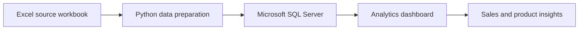

# E-Commerce Sales Analytics Dashboard

An end-to-end e-commerce sales analytics project documenting the journey from an Excel source workbook to Python data preparation, SQL Server storage, and a business-facing dashboard.

> The dashboard pages included here are the first two pages of the supplied report. The source workbook, Python scripts, SQL Server schema/data, and editable dashboard file were not included with the source material, so this repository documents the workflow and presents the report preview without claiming those implementation files are available.

## Dashboard preview

### Sales overview


### Product and category analysis


[Download the two-page dashboard PDF](assets/dashboard-preview/e-commerce-dashboard-pages-1-2-optimized.pdf)

## Project story

The work started with sales data in Excel. Python was used to prepare and structure the data, which was then stored in Microsoft SQL Server for querying. The final dashboard turns the prepared data into a concise view of sales trends, product performance, categories, brands, and orders.



## What the report shows

- **Sales overview:** date range, order count, total sales amount, products sold, and monthly sales trend.
- **Product performance:** highest-selling products and a product table with category, brand, quantity, reviews, rating, and sales amount.
- **Category analysis:** sales comparison across Electronics, Fashion, Computers, Wearables, and Accessories.
- **Brand analysis:** a breakdown of sales by brand.

The first page displays total sales of **$302.13M** and **10.002K orders** for the selected date range (**January 1 to December 26, 2024**). The report labels the product KPI “Total Products Sold” and shows **10**; that label/value is reproduced as shown in the source report.

## Repository contents

```text
.
├── .gitignore
├── README.md
├── docs/
│   └── PROJECT_OVERVIEW.md
└── assets/
    └── dashboard-preview/
        ├── e-commerce-dashboard-pages-1-2-optimized.pdf
        ├── product-analysis-preview.jpg
        └── sales-overview-preview.jpg
```

## Tools and workflow

| Stage | Tool | Role |
| --- | --- | --- |
| Source data | Microsoft Excel | Initial sales workbook |
| Preparation | Python | Cleaning and transformation step |
| Data storage | Microsoft SQL Server | Structured storage and querying |
| Reporting | Dashboard | Sales, product, category, and brand analysis |

## Reproducing the full project

To make this repository fully reproducible, add the source workbook (or a privacy-safe sample), Python preparation scripts, SQL Server schema and queries, and the editable dashboard project. Avoid committing credentials or confidential customer-level data.

## Source

Dashboard preview extracted from the supplied **E-Commerce Sales.pdf**. Only pages 1 and 2 are included in this repository.
