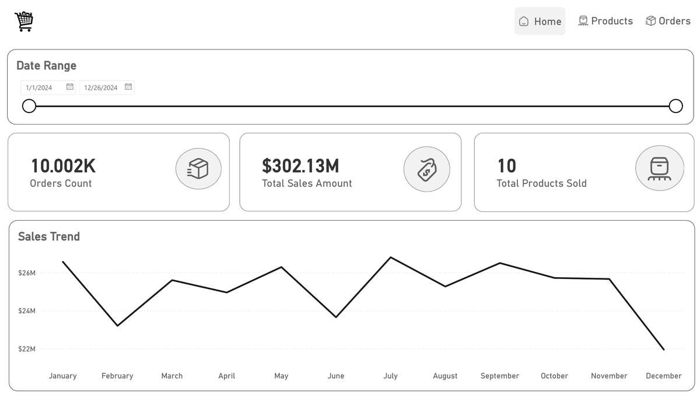
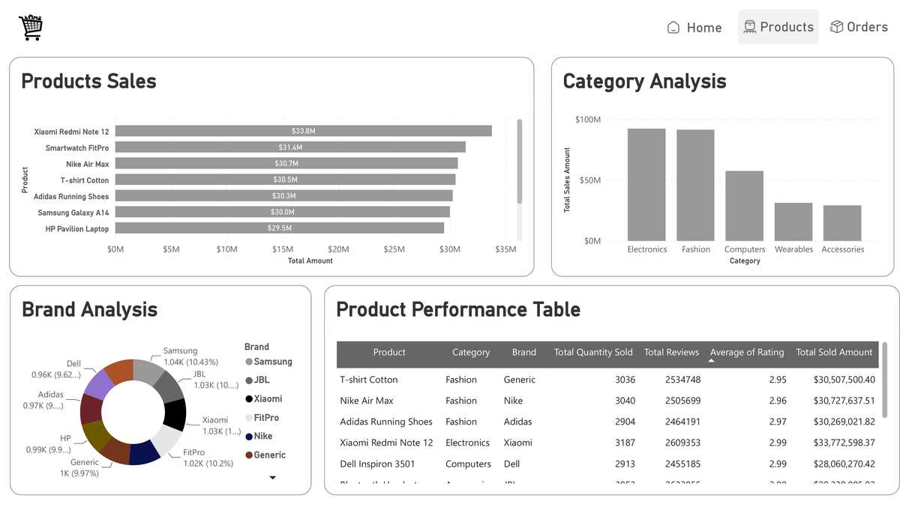

# E-Commerce Sales Analytics

An end-to-end e-commerce sales analytics project that prepares a source dataset with Python, loads a fact-and-dimension model into Microsoft SQL Server, and presents business insights in a dashboard report.

## Dashboard preview

### Sales overview



### Product and category analysis



[Download the two-page dashboard PDF](assets/dashboard-preview/e-commerce-dashboard-pages-1-2-optimized.pdf)

## Project workflow


The project began with sales data in Excel. The included 10,005-row CSV is the analysis dataset. The Python script parses dates, derives sales amounts, builds dimension tables, loads the model into SQL Server, and runs summary queries. The dashboard report presents sales trends and product, category, and brand performance.

## Dashboard highlights

- Total sales shown: **$302.13M**
- Orders shown: **10.002K**
- Date range shown: **January 1 to December 26, 2024**
- Product sales ranking, category comparison, brand mix, and product performance table

The product KPI is labeled “Total Products Sold” and displays **10** in the source report. Values above are reproduced as shown and were not independently recalculated against the SQL database.

## Repository contents

```text
.
├── .gitignore
├── README.md
├── main.py
├── requirements.txt
├── ecommerce_10000.csv.gz
├── Icons/
│   ├── categories.svg
│   ├── home.svg
│   ├── orders.svg
│   ├── products.svg
│   └── sales.svg
├── docs/
│   └── PROJECT_OVERVIEW.md
└── assets/
    └── dashboard-preview/
        ├── e-commerce-dashboard-pages-1-2-optimized.pdf
        ├── product-analysis-preview.jpg
        └── sales-overview-preview.jpg
```

The Python environment and IDE settings from the source folder are intentionally omitted. The dataset is stored as gzip-compressed CSV; `main.py` reads it directly.

## Run the pipeline

1. Install Python 3.10 or later, Microsoft SQL Server LocalDB, and Microsoft ODBC Driver 17 for SQL Server.
2. Install Python dependencies:

   ```bash
   pip install -r requirements.txt
   ```

3. From the repository root, run:

   ```bash
   python main.py
   ```

The script connects to `(localdb)\MSSQLLocalDB`, uses the `ecommerce_10000` database, creates/replaces the dimension and fact tables, and prints the sales date range, distinct order count, and top-selling product.

## Data model

- `fact_sales`
- `dim_product`
- `dim_platform`
- `dim_date`
- `dim_customer_address`

The tables are created by `pandas.DataFrame.to_sql`; separate SQL schema scripts were not part of the supplied project folder. The editable dashboard project was also not present, so this repository includes the two-page PDF report and static previews.
